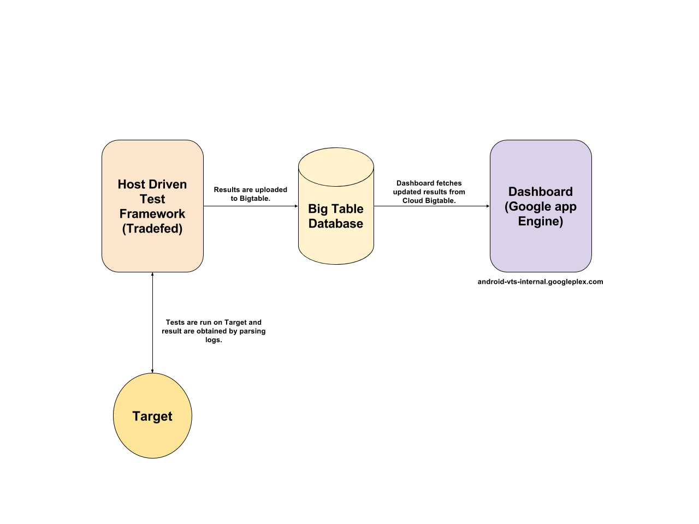
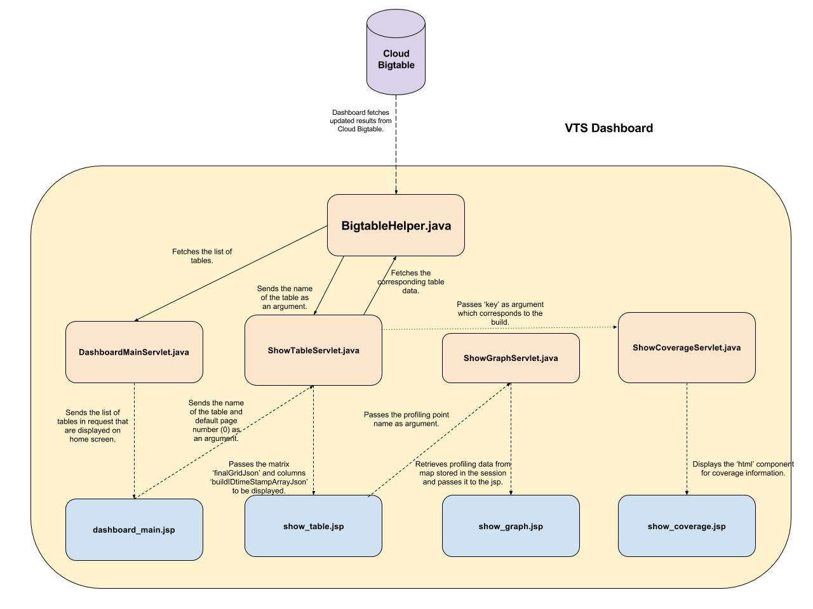

# VTS Dashboard

## Introduction

The VTS Dashboard displays the summarized results of the Multi Device Tests along with graphs.

## High Level Design

The high level view is that tests are through tradefed on multiple devices and results are uploaded to cloud Bigtable
database using Protocol Buffer. The Google app engine then reads data from the cloud and presents it on the dashboard.



## Google App Engine Architecture

The following diagram discusses the flow of the dashboard wrt to the directory :
/vts/web/dashboard/appengine/servlet/src/main/java/com/google/android/vts/servlet



## Installation

### Steps to run locally:

1. Google App Engine uses Java 8. Install Java 8 before running running locally:
   'sudo apt install openjdk-8-jdk'

   To use java 8:
   Copy the following lines in ~/.bashrc :

```
    function setup_jdk() {
      # Remove the current JDK from PATH
      if [ -n "$JAVA_HOME" ] ; then
        PATH=${PATH/$JAVA_HOME\/bin:/}
      fi
      export JAVA_HOME=$1
      export PATH=$JAVA_HOME/bin:$PATH
    }

    function use_java8() {
    #  setup_jdk /usr/java/jre1.8.0_73
      setup_jdk /usr/lib/jvm/java-8-openjdk-amd64
    }

    Then from cmd:
    $ use_java8
```

2. Maven is used for build. Install Maven 3.3.9:
   Download maven from:
   https://maven.apache.org/download.cgi

   Steps to Install Maven:
   1) Unzip the Binary tar:
      tar -zxf apache-maven-3.3.3-bin.tar.gz

   2) Move the application directory to /usr/local
      sudo cp -R apache-maven-3.3.3 /usr/local

   3) Make a soft link in /usr/bin for universal access of mvn
      sudo ln -s /usr/local/apache-maven-3.3.3/bin/mvn /usr/bin/mvn

   4) Verify maven installation:
      $ mvn -v

      The output should resemble this:

      Apache Maven 3.3.9 (bb52d8502b132ec0a5a3f4c09453c07478323dc5; 2015-11-10T08:41:47-08:00)
      Maven home: /opt/apache-maven-3.3.9
      Java version: 1.8.0_45-internal, vendor: Oracle Corporation
      Java home: /usr/lib/jvm/java-8-openjdk-amd64/jre
      Default locale: en_US, platform encoding: UTF-8
      OS name: "linux", version: "3.13.0-88-generic", arch: "amd64", family: "unix"

3. Install Google Cloud SDK. Follow the instructions listed on official source:
   https://cloud.google.com/sdk/docs/quickstart-linux

   The default location where the application searches for a google-cloud-sdk is:
   /usr/local/share/google/google-cloud-sdk

   Therefore move the extracted folder to this location: /usr/local/share/google/

   Otherwise, to have a custom location, specify the location of
   google-cloud-sdk in /vts/web/dashboard/appengine/servlet/pom.xml by putting the configuration:

```
   <configuration>
     <gcloud_directory>PATH/TO/GCLOUD_DIRECTORY</gcloud_directory>
   </configuration>
```
   within the 'com.google.appengine' plugin tag :

   Install the Google App Engine Python SDK:
   https://cloud.google.com/appengine/downloads#Google_App_Engine_SDK_for_Python

4. (Optional) Configure App Engine authorized senders

   In order for the dashboard to send alert emails when test failures occur, the
   sender address must be added to the authorized list. Navigate to the App Engine
   settings page and edit the list "Email API Authorized senders". The address
   VTS_EMAIL_ADDRESS in VtsAlertJobServlet must be authorized before alerts will
   successfully send. For more information about sending mail on App Engine, visit:
   https://cloud.google.com/appengine/docs/java/mail/

## To run GAE on local machine:

`$ cd web/dashboard/appengine/servlet`
`$ mvn clean gcloud:run`

## To deploy to Google App Engine

Caution: only a release engineer must do the following based on a procedure.

`$ cd web/dashboard/appengine/servlet`
`$ mvn clean gcloud:deploy`

To update cron jobs

`$ cd web/dashboard/appengine/servlet`
`$ <your appengine-java-sdk dir>/bin/appcfg.sh update_cron src/main/webapp/`

visit https://<YOUR-PROJECT-NAME>.googleplex.com
